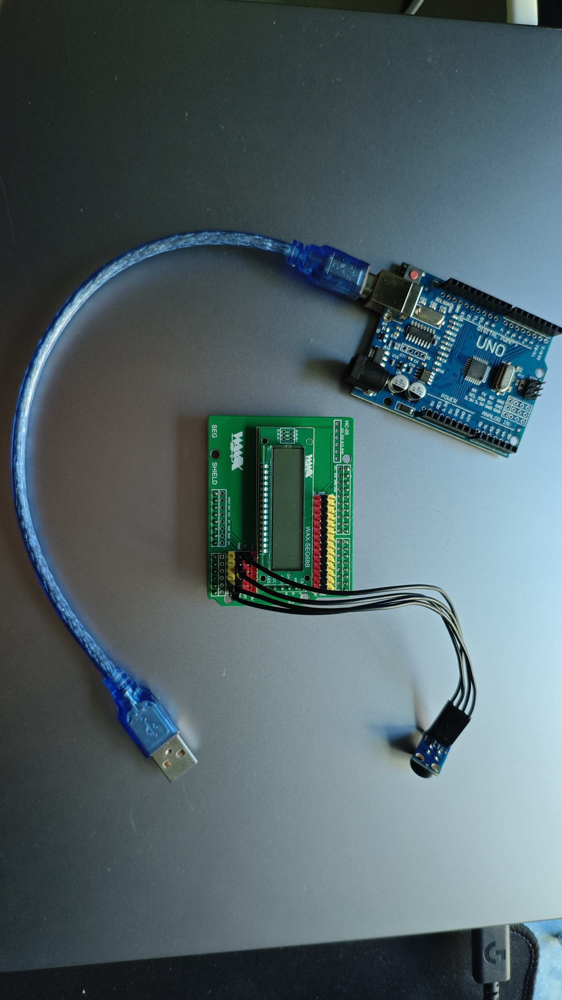
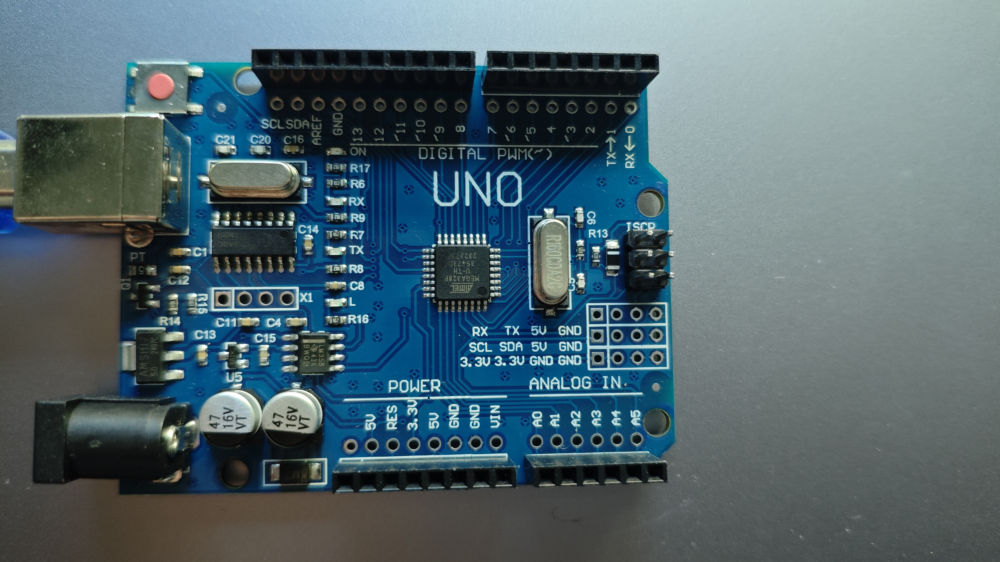
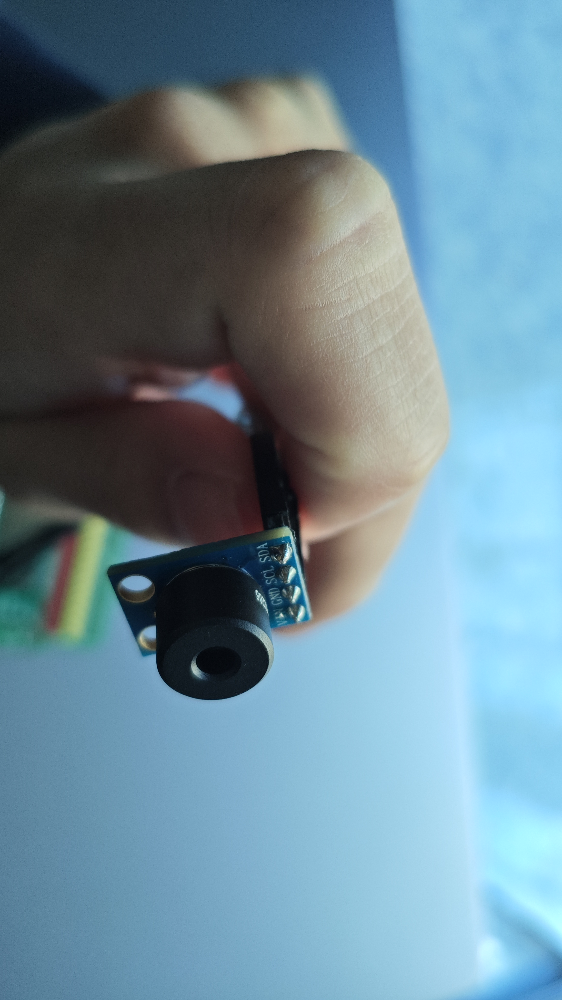
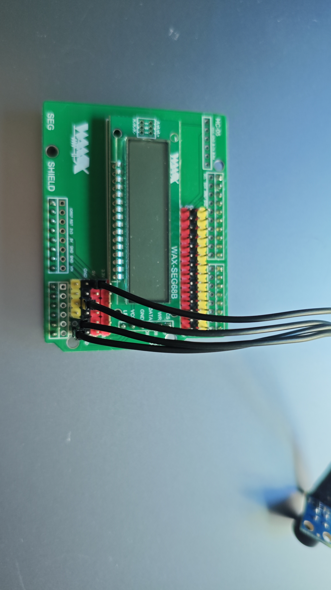
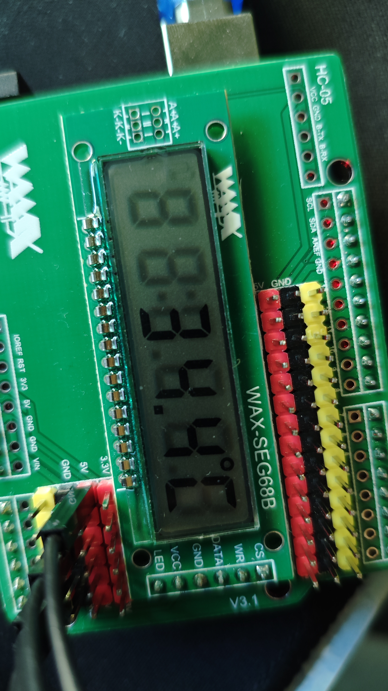
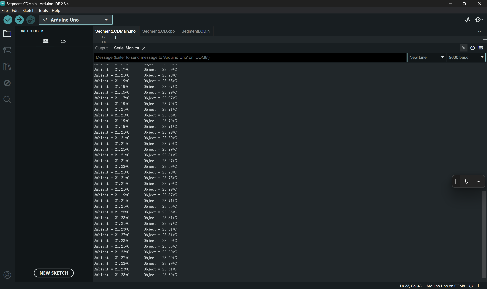
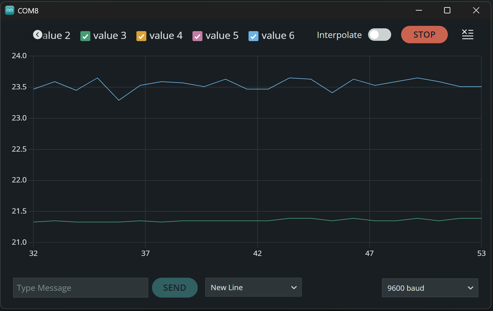

# Infrared Thermometer Project with MLX90614 and Segment LCD

## Project Overview

This project implements a non-contact infrared thermometer using an Arduino UNO, an MLX90614 IR temperature sensor, and a custom segment LCD driven by an HT1621 (WAX-SEG68B is used and compatible with HT1621).  The thermometer displays both object and ambient temperatures in real-time with a resolution of 0.1°C.

## Hardware Components

### Complete Setup

*All components assembled together*

### Individual Components
1. **Arduino UNO Board**

*Arduino UNO board - the main controller*

2. **MLX90614 IR Temperature Sensor**

*MLX90614 sensor with pin configuration*

3. **LCD Debug Module**

*LCD module with MLX90614 debug connections (Note: For final assembly, MLX90614 should be directly connected to UNO with male-female jumper wires)*

### Device in Operation

*Temperature measurement in progress - sensor pointing at oral cavity*

### Serial Monitor Output

*Real-time temperature data output in serial monitor*


*Temperature variation graph in serial plotter*

## Key Features

1.  **Dual Temperature Measurement:**
    *   Object temperature range: -70°C to +380°C
    *   Ambient temperature range: -40°C to +85°C
    *   Accuracy: ±0.5°C at room temperature

2.  **Measurement Algorithm:**
    Raw sensor data is converted to Celsius using the following formula:
    ```
    Temperature = (raw_value * 0.02) - 273.15
    ```

3.  **Display System:**
    *   6-digit segment LCD with custom glyph encoding.
    *   Supports special characters (e.g., °C symbol).
    *   Refresh rate: 500ms. **It can be changed in the code to gain higher temporal resolution.**

4.  **Sensor Configuration:**
    *   Fixed I2C address: 0x5A
    *   Field of view: 90°
    *   Factory calibrated outputs.

## Technical Specifications

| Parameter           | Value                       |
| ------------------- | ---------------------------- |
| Power Supply        | 4.5-5.5V DC                 |
| Measurement Range   | -70°C to +380°C (Object)     |
| Accuracy            | ±0.5°C @ room temperature   |
| Field of View       | 90°                         |
| Resolution          | 0.02°C                      |
| Refresh Rate        | 500ms                       |

## Hardware Interface

### MLX90614 Sensor Connections:

*   VIN: Connect to Arduino 5V pin (4.5-5.5V DC power input)
*   GND: Connect to Arduino GND
*   SCL: Connect to Arduino A5 (I2C Clock)
*   SDA: Connect to Arduino A4 (I2C Data)

Important Notes:
*   Pull-up resistors (2.2kΩ~10kΩ) are required on the I2C bus (some development boards have built-in pull-ups)
*   Power supply voltage must be strictly controlled within 4.5-5.5V range
*   Default I2C address 0x5A is used in the code (hardware-defined)

### LCD Connections:

*   DATA: Pin 9
*   WR: Pin 8
*   CS: Pin 7

## Dependencies

*   Arduino IDE
*   Wire Library (for I2C communication)
*   Adafruit MLX90614 Library (modified -  Note: The original document mentions a *modified* version.  If there are specific modifications, consider including a link to your modified library or a description of the changes here.)

## Usage

1.  Connect the hardware components according to the pin definitions provided above.
2.  Upload the firmware to the Arduino UNO. Make sure driver is installed in Arduino root folder.
3.  Power cycle the device. Red light on.
4.  Point the sensor at the target object.
5.  Read the temperature from the LCD display or serial monitor.


## Documentation Reference

*   **MLX90614 Datasheet:**  [Consult the datasheet](https://cdn-shop.adafruit.com/datasheets/MLX90614.pdf) for complete sensor specifications, electrical characteristics, and communication protocol details.